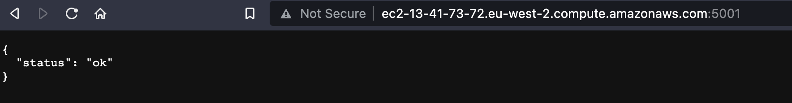
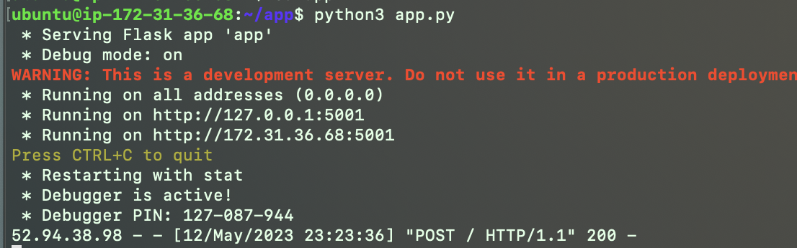
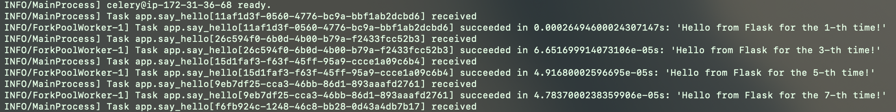

# Using Celery, Flask, and AWS SNS for event-driven workloads
This repo is just a quick tutorial on how to run event-driven workloads using Celery, Flask, and SNS. We'll use S3 Events as the producer in this pub-sub model but we can also talk to our HTTP endpoint directly.

## Prerequisites
As prerequisites, you need to have 

- A way to expose a public HTTP endpoint, e.g. by launching an EC2 instance
- An SNS queue
- Celery, Flask, and Redis installed

## Walkthrough
First, launch an EC2 instance. Get pip to install Flask and Celery and also install Redis. The installation will vary based on the AMI you use. I used an Ubuntu AMI.

Make sure you can SSH into the instance and that it can receive HTTP traffic. You can either configure the Flask app to listen on port 80 or, in my case, set a Custom TCP rule to allow traffic on port 5001 from anywhere.

Create `app.py`, which will contain our Flask app as well as the definition of our celery task. An example `app.py` is provided.

Two endpoints are defined: `/` and `/sns`. The `/sns` endpoint is necessary for confirming the SNS subscription. In SNS, create a new subscription that uses your instance's DNS, using HTTP, and using the `/sns` endpoint. Use HTTP and a URL like `http://ec2-13-41-73-72.eu-west-2.compute.amazonaws.com:5001/sns`. Then confirm the subscription. 

Next, we'll define any endpoints we want, for example, we can use `/`. Ensure `/` allows the POST method, as that's how we'll receive notifications from SNS. In my case, it'll just say "Hello from Flask for the i-th time" a 100 times.

Now we can run Redis and Celery. We will use Redis as the broker. Simply start Redis, e.g.`sudo systemctl restart redis.service`. Run `redis-cli ping` to check it works - if it returns PONG, it works.

Now run Celery with `celery -A app.celery worker --loglevel=info`. 

At this point, we have
- An HTTP endpoint exposed that can receive traffic over the public internet
- This endpoint, `/`, will use Redis to send tasks to Celery
- A Celery worker ready to execute our tasks!

Simply navigate to your endpoint, e.g. `http://ec2-13-41-73-72.eu-west-2.compute.amazonaws.com:5001/` (your DNS will be different, of course, or use the public IPv4). Notice we now use `/` as the endpoint, not `/sns`. It will only work if you allow GET as a method on the endpoint. It will look as below

Finally, we want to trigger our jobs through SNS. I created a bucket, which will have an S3 Event. This means that as soon as I create a file with a certain prefix, a message will be sent to SNS, which will then send a message to the HTTP endpoint, in turn triggering Celery to execute our task. Make sure that you allow the S3 bucket to publish events to your SNS queue - an access policy like in `access_policy.json` will work.

Now we can customise our workflow as we see fit in response to receiving a message!

For example, when I upload a file to my S3 Bucket matching the pattern I specified, Flask receives the POST request:

And this then triggers Celery to say "hello" a 100 times:

(In this case, I have two worker processes, so worker 1 only does uneven numbers.)

## Next steps
The main next steps would be to use HTTPS as it's more secure and customise what actions we want to take.